# Auth Module — ระบบ Authentication

## สถาปัตยกรรม (Clean Architecture)

```mermaid
flowchart TB
    subgraph Presentation["PRESENTATION LAYER<br/>Angular Components"]
        AuthLayout["AuthLayoutComponent<br/>layouts/auth-layout"]
        Login["LoginComponent<br/>pages/login"]
        Forgot["ForgotPasswordComponent<br/>pages/forgot-password"]
        Reset["ResetPasswordComponent<br/>pages/reset-password"]
        SignUp["SignUpComponent<br/>pages/sign-up"]
        Lock["LockScreenComponent<br/>pages/lock-screen"]
        TwoStep1["TwoStepVerificationComponent<br/>pages/two-step-verification"]
        TwoStep2["TwoStepCodeComponent<br/>pages/two-step-code"]
        UserList["UserListComponent<br/>pages/user-list"]
        UserCreate["UserCreateComponent<br/>pages/user-create"]
        RoleList["RoleListComponent<br/>pages/role-list"]
        Theme["ThemeSettingsComponent<br/>pages/theme-settings"]
    end

    subgraph Domain["DOMAIN LAYER<br/>Business Logic"]
        UserEntity["user.entity.ts<br/>User, LoginCredentials, AuthResponse"]
        PermEntity["permission.entity.ts<br/>Permission"]
        AuthRepo["auth.repository.ts<br/>IAuthRepository (interface)"]
        LoginUC["login.use-case.ts<br/>LoginUseCase"]
        LogoutUC["logout.use-case.ts<br/>LogoutUseCase"]
        RefreshUC["refresh-token.use-case.ts<br/>RefreshTokenUseCase"]
        ForgotUC["forgot-password.use-case.ts<br/>ForgotPasswordUseCase"]
        ResetUC["reset-password.use-case.ts<br/>ResetPasswordUseCase"]
        CheckPermUC["check-permission.use-case.ts<br/>CheckPermissionUseCase"]
    end

    subgraph Data["DATA LAYER<br/>API Communication"]
        AuthAPI["auth.api.datasource.ts<br/>AuthApiDataSource"]
        LoginReqDTO["login-request.dto.ts<br/>LoginRequestDto"]
        LoginResDTO["login-response.dto.ts<br/>LoginResponseDto"]
        AuthRepoImpl["auth.repository.impl.ts<br/>AuthRepositoryImpl"]
        DemoRepo["auth.repository.demo.ts<br/>DemoAuthRepositoryImpl"]
    end

    subgraph External["EXTERNAL</br/>ICMON API v1"]
        APILogin["POST /api/v1/auth/login"]
        APILogout["POST /api/v1/auth/logout"]
        APIRefresh["POST /api/v1/auth/refresh"]
        APIForgot["POST /api/v1/auth/forgot-password"]
        APIReset["POST /api/v1/auth/reset-password"]
        APIMe["GET /api/v1/auth/me"]
        APIPerm["GET /api/v1/auth/permissions"]
    end

    subgraph Config["CORE CONFIG"]
        APIEndpoints["api.config.ts<br/>API_ENDPOINTS"]
        Env["environment.ts<br/>apiUrl: http://localhost:1080/api/v1"]
        Tokens["di/tokens.ts<br/>AUTH_REPOSITORY"]
        Constants["app.constants.ts<br/>APP_CONSTANTS"]
    end

    Login --> LoginUC
    LoginUC --> AuthRepo
    AuthRepo --> AuthRepoImpl
    AuthRepoImpl --> AuthAPI
    AuthAPI --> APIEndpoints
    AuthAPI --> Env
    AuthAPI -.-> APILogin
    AuthAPI -.-> APILogout
    AuthAPI -.-> APIRefresh
    AuthAPI -.-> APIMe

    AuthRepoImpl -.-> LoginReqDTO
    AuthRepoImpl -.-> LoginResDTO

    DemoRepo -.-> AuthRepo

    LoginUC --> Constants
    Forgot --> ForgotUC
    ForgotUC --> AuthRepo
    Reset --> ResetUC
    ResetUC --> AuthRepo

    AuthRepoImpl --> Tokens
    DemoRepo --> Tokens
```



---

## 1. ฟังก์ชันการทำงาน

| ฟังก์ชัน | Component | Use Case | API Endpoint |
|----------|-----------|----------|-------------|
| เข้าสู่ระบบ | `LoginComponent` | `LoginUseCase` | `POST /api/v1/auth/login` |
| ออกจากระบบ | — | `LogoutUseCase` | `POST /api/v1/auth/logout` |
| รีเฟรช Token | — | `RefreshTokenUseCase` | `POST /api/v1/auth/refresh` |
| ลืมรหัสผ่าน | `ForgotPasswordComponent` | `ForgotPasswordUseCase` | `POST /api/v1/auth/forgot-password` |
| ตั้งรหัสผ่านใหม่ | `ResetPasswordComponent` | `ResetPasswordUseCase` | `POST /api/v1/auth/reset-password` |
| สมัครสมาชิก | `SignUpComponent` | — | — |
| ล็อกหน้าจอ | `LockScreenComponent` | — | — |
| 2FA ตั้งค่า | `TwoStepVerificationComponent` | — | — |
| 2FA ยืนยัน | `TwoStepCodeComponent` | — | — |
| จัดการผู้ใช้ | `UserListComponent` | — | `GET /api/v1/users` |
| เพิ่มผู้ใช้ | `UserCreateComponent` | — | `POST /api/v1/users` |
| จัดการบทบาท | `RoleListComponent` | — | `GET /api/v1/roles` |
| ตั้งค่าธีม | `ThemeSettingsComponent` | — | LocalStorage |

---

## 2. โครงสร้างไฟล์

```
src/app/features/auth/
├── domain/                          # Domain Layer
│   ├── entities/
│   │   ├── user.entity.ts           # User, LoginCredentials, AuthResponse
│   │   └── permission.entity.ts     # Permission
│   ├── repositories/
│   │   └── auth.repository.ts       # IAuthRepository interface
│   └── use-cases/
│       ├── login.use-case.ts        # เข้าสู่ระบบ + เก็บ Token
│       ├── logout.use-case.ts       # ออกจากระบบ
│       ├── refresh-token.use-case.ts# ต่ออายุ Token
│       ├── forgot-password.use-case.ts # ขอรีเซ็ตรหัสผ่าน
│       ├── reset-password.use-case.ts  # ตั้งรหัสผ่านใหม่
│       └── check-permission.use-case.ts # ตรวจสอบสิทธิ์
│
├── data/                            # Data Layer
│   ├── datasources/
│   │   └── auth.api.datasource.ts   # HTTP calls to ICMON API v1
│   ├── dtos/
│   │   ├── login-request.dto.ts     # { username, password }
│   │   └── login-response.dto.ts    # { accessToken, refreshToken, expiresIn, tokenType, user }
│   └── repositories/
│       ├── auth.repository.impl.ts  # Production implementation
│       └── auth.repository.demo.ts  # Demo/Mock implementation
│
└── presentation/                    # Presentation Layer
    ├── layouts/
    │   └── auth-layout/             # Minimal layout (no sidebar)
    │       └── auth-layout.component.ts
    └── pages/
        ├── login/                   # หน้าเข้าสู่ระบบ (AuthLayout)
        ├── forgot-password/         # หน้าลืมรหัสผ่าน (AuthLayout)
        ├── reset-password/          # หน้ารีเซ็ตรหัสผ่าน (AuthLayout)
        ├── sign-up/                 # หน้าสมัครสมาชิก (AuthLayout)
        ├── lock-screen/             # หน้าล็อกหน้าจอ (AuthLayout)
        ├── two-step-verification/   # ตั้งค่า 2FA (AuthLayout)
        ├── two-step-code/           # ยืนยัน 2FA (AuthLayout)
        ├── user-list/               # จัดการผู้ใช้ (AppLayout)
        ├── user-create/             # เพิ่มผู้ใช้ (AppLayout)
        ├── role-list/               # จัดการบทบาท (AppLayout)
        └── theme-settings/          # ตั้งค่าธีม (AppLayout)
```

---

## 3. API จริง — ICMON API v1

### 3.1 Base URL
```
http://localhost:1080/api/v1
```
กำหนดใน `src/environments/environment.ts`

### 3.2 Auth Endpoints

| Method | Path | Request Body | Response |
|--------|------|-------------|----------|
| POST | `/auth/login` | `{ username, password }` | `{ accessToken, refreshToken, expiresIn, tokenType, user }` |
| POST | `/auth/logout` | `{}` | 204 No Content |
| POST | `/auth/refresh` | `{}` | `{ accessToken, refreshToken, expiresIn, tokenType, user }` |
| POST | `/auth/forgot-password` | `{ email }` | 204 No Content |
| POST | `/auth/reset-password` | `{ token, password }` | 204 No Content |
| GET | `/auth/me` | — | `{ User object }` |
| GET | `/auth/permissions` | — | `string[]` |

### 3.3 ตัวอย่างการเรียก Login

```bash
curl -X 'POST' \
  'http://localhost:1080/api/v1/auth/login' \
  -H 'accept: application/json' \
  -H 'Content-Type: application/json' \
  -d '{
  "username": "admin",
  "password": "P@ssw0rd"
}'
```

### 3.4 ตัวอย่าง Response

```json
{
  "accessToken": "eyJhbGciOiJIUzI1NiJ9...",
  "refreshToken": "eyJhbGciOiJIUzI1NiJ9...",
  "expiresIn": 3600,
  "tokenType": "Bearer",
  "user": {
    "id": "cea342be-db34-448c-bcef-eb60e7797e73",
    "username": "admin",
    "email": "admin@gmail.com",
    "fullName": "admin dev",
    "status": "ACTIVE",
    "phoneNumber": "0955088091",
    "profileImageUrl": null,
    "role": "USER"
  }
}
```

---

## 4. Data Flow — Login Process

```
User Input (username/password)
       │
       ▼
LoginComponent.onSubmit()
       │
       ▼
LoginUseCase.execute(credentials)
       │  @Inject(AUTH_REPOSITORY)
       ▼
AuthRepositoryImpl.login(credentials)
       │
       ├─→ LoginRequestDto { username, password }
       │
       ▼
AuthApiDataSource.login(dto)
       │  environment.apiUrl + API_ENDPOINTS.auth.login
       │  = "http://localhost:1080/api/v1/auth/login"
       ▼
HTTP POST → ICMON API v1
       │
       ▼
Response: LoginResponseDto { accessToken, refreshToken, expiresIn, tokenType, user }
       │
       ▼
AuthRepositoryImpl.mapToAuthResponse(dto)
       │  DTO → Entity mapping
       ▼
AuthResponse { user: User, accessToken, refreshToken, expiresIn, tokenType }
       │
       ▼ (tap in LoginUseCase)
Store tokens to localStorage
       │  APP_CONSTANTS.TOKEN_KEY
       │  APP_CONSTANTS.REFRESH_TOKEN_KEY
       │  APP_CONSTANTS.USER_KEY
       ▼
Router → /dashboard
```

---

## 5. Dependency Injection

| Token | Provider | Environment |
|-------|----------|-------------|
| `AUTH_REPOSITORY` | `AuthRepositoryImpl` | `demo: false` (production) |
| `AUTH_REPOSITORY` | `DemoAuthRepositoryImpl` | `demo: true` (development) |

Providers ถูกตั้งค่าใน `src/app/app.module.ts`:

```typescript
{ provide: AUTH_REPOSITORY, useClass: environment.demo ? DemoAuthRepositoryImpl : AuthRepositoryImpl }
```

---

## 6. Key Design Decisions

| Decision | Rationale |
|----------|-----------|
| **username-based login** | Real API uses `username` not `email` |
| **Full URL construction in datasource** | `environment.apiUrl` + `API_ENDPOINTS` path — no global interceptor needed |
| **Demo repository** | Use `DemoAuthRepositoryImpl` when `environment.demo = true` for offline development |
| **AuthLayout vs AppLayout** | Login/forgot/reset/sign-up/lock/2FA use minimal `AuthLayoutComponent` (no sidebar); users/roles/theme use `AppLayoutComponent` with sidebar |
| **JWT stored in localStorage** | Tokens stored via `APP_CONSTANTS.TOKEN_KEY` in `login.use-case.ts` |
| **Standalone components** | All pages are standalone for lazy loading |
| **Signals not used** | Current implementation uses classic property binding for simplicity |

---

## 7. Swagger API Documentation

API documentation available at:
```
http://localhost:1080/swagger-ui/index.html
```

---

## 8. การเรียก API จริง

```typescript
// ตัวอย่างเรียก API จริงจาก AuthApiDataSource
const baseUrl = environment.apiUrl;  // "http://localhost:1080/api/v1"
const endpoint = API_ENDPOINTS.auth.login;  // "/auth/login"
const fullUrl = `${baseUrl}${endpoint}`;  // "http://localhost:1080/api/v1/auth/login"
```
